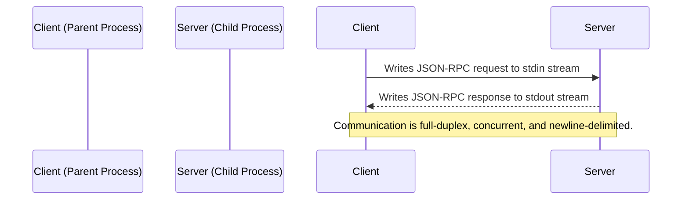

# Calculator Learning Demo - STDIO Transport

<div align="center">

[](https://modelcontextprotocol.io)
[](https://www.typescriptlang.org/)
[](https://spec.modelcontextprotocol.io/specification/basic/transports/#stdio)
[](LICENSE)

</div>

## 🎯 Overview

This repository demonstrates a **learning-edition MCP calculator server using STDIO transport**. It showcases the Model Context Protocol (MCP) SDK implementation with standard `tools/list` and `tools/call` methods, communicating via `stdin` and `stdout` using JSON-RPC messages.

This transport is the most performant and secure option for local inter-process communication (IPC).

### Key Characteristics

-   **Transport Layer:** Direct `stdin`/`stdout` pipes between parent (client) and child (server) processes.
-   **State Model:** Ephemeral, in-process memory. All state (e.g., calculation history) is lost when the process exits.
-   **Latency:** The lowest possible latency (microseconds), as it avoids all network stack overhead.
-   **Security:** Extremely high due to OS-level process isolation. There is no network attack surface.
-   **Use Case:** Ideal for high-performance, secure local tooling, such as command-line interfaces (CLIs), IDE plugins, and build-system integrations.

## 📊 Transport Comparison

This table compares the four primary MCP transport mechanisms demonstrated in the learning series. The implementation in **this repository is highlighted**.

| Dimension | **STDIO** | SSE (Legacy) | Streamable HTTP (Stateful) | Streamable HTTP (Stateless) |
|:-----------|:-----------|:---------|:---------------------|:-------------------------------|
| **Transport Layer** | **Local Pipes (`stdin`/`stdout`)** | 2 × HTTP endpoints (`GET`+`POST`) | Single HTTP endpoint `/mcp` | Single HTTP endpoint `/mcp` |
| **Bidirectional Stream** | ✅ **Yes (full duplex)** | ⚠️ Server→Client only | ✅ Yes (server push + client stream) | ✅ Yes (within each request) |
| **State Management** | **Ephemeral (Process Memory)** | Ephemeral (Session Memory) | Persistent (Session State) | ❌ None (Stateless) |
| **Resumability** | ❌ **None** | ❌ None | ✅ Yes (`Last-Event-Id`) | ❌ None (by design) |
| **Scalability** | ⚠️ **Single Process** | ✅ Multi-Client | ✅ Horizontal (Sticky Sessions) | ♾️ Infinite (Serverless) |
| **Security** | 🔒 **Process Isolation** | 🌐 Network Exposed | 🌐 Network Exposed | 🌐 Network Exposed |
| **Ideal Use Case** | ✅ **CLI Tools, IDE Plugins** | Legacy Web Apps | Enterprise APIs, Workflows | Serverless, Edge Functions |

## 📐 Architecture and Flow

The STDIO transport architecture is based on a parent-child process model. A client application spawns the MCP server as a child process and communicates with it by writing to the child's `stdin` and reading from its `stdout`.



### MCP SDK Implementation

This repository contains a single, production-ready MCP server implementation:

-   **`dist/server.js`** - Built with the official `@modelcontextprotocol/sdk`
-   Uses standard MCP methods: `tools/list`, `tools/call`, `resources/list`, `prompts/list`
-   High-level abstractions with `server.registerTool()` and `server.registerResource()`
-   Compatible with all MCP clients and registries (including Smithery)

## ✨ Feature Compliance

This server implements the complete MCP Latest Standard feature set for the learning edition.

| Name | Status | Implementation |
|:------|:--------|:----------------|
| `calculate` | **Core ✅** | Basic arithmetic with optional streaming progress. |
| `batch_calculate` | **Extended ✅** | Processes multiple calculations in a single request. |
| `advanced_calculate` | **Extended ✅** | Factorial, logarithm, and combinatorics operations. |
| `demo_progress` | **Extended ✅** | Demonstrates progress notifications over the `stdout` stream. |
| `explain-calculation` | **Core ✅** | Returns a Markdown explanation of a calculation. |
| `generate-problems` | **Core ✅** | Returns Markdown-formatted practice problems. |
| `calculator-tutor` | **Core ✅** | Returns Markdown-formatted tutoring content. |
| `solve_math_problem` | **Extended ✅** | Solves a math problem, may elicit input. |
| `explain_formula` | **Extended ✅** | Provides an interactive formula explanation. |
| `calculator_assistant` | **Extended ✅** | Offers interactive calculator assistance. |
| `calculator://constants` | **Core ✅** | Resource for mathematical constants (π, e, φ, etc.). |
| `calculator://history/{id}` | **Extended ✅** | Resource for the last 50 calculation results stored in memory. |
| `calculator://stats` | **Extended ✅** | Resource for server uptime and request statistics. |
| `formulas://library` | **Extended ✅** | Resource for a collection of mathematical formulas. |

## 🚀 Getting Started

### Prerequisites

*   Node.js (v18.x or higher)
*   npm or yarn

### Installation

```bash
# Clone the repository
git clone https://github.com/modelcontextprotocol/mcp-server-examples.git
cd mcp-server-examples/stdio

# Install dependencies
npm install

# Build the project
npm run build
```

### Running the Server

The server is designed to be spawned by a client. You can run it directly to send it commands interactively.

```bash
# Run the MCP server
npm start

# Run directly with Node.js
node dist/server.js --stdio

# Run in development mode
npm run dev
```

### Testing with MCP Inspector

Interact with the SDK-based server using the official MCP Inspector CLI. This command spawns the server and pipes its I/O to the inspector.

```bash
npx @modelcontextprotocol/inspector --cli "node dist/server.js --stdio"
```

## 📋 API Usage Examples

All requests use standard MCP protocol with JSON-RPC messages.

### Standard MCP Protocol

The server implements the standard MCP SDK protocol:

```bash
# List available tools
→ {"jsonrpc":"2.0","id":1,"method":"tools/list","params":{}}

# Call a tool
→ {"jsonrpc":"2.0","id":2,"method":"tools/call","params":{"name":"calculate","arguments":{"a":7,"b":6,"op":"multiply"}}}

# Response
{"jsonrpc":"2.0","id":2,"result":{"content":[{"type":"text","text":"7 × 6 = 42"}]}}
```

### Progress Demonstration

Progress notifications are sent as standard JSON-RPC notifications (no `id` field) over `stdout`.

```bash
# Request
→ {"jsonrpc":"2.0","id":3,"method":"tools/call","params":{"name":"demo_progress","arguments":{}}}

# Response Stream
{"jsonrpc":"2.0","method":"progress","params":{"progressToken":"progress_3","progress":20,"total":100}}
{"jsonrpc":"2.0","method":"progress","params":{"progressToken":"progress_3","progress":40,"total":100}}
{"jsonrpc":"2.0","method":"progress","params":{"progressToken":"progress_3","progress":60,"total":100}}
{"jsonrpc":"2.0","method":"progress","params":{"progressToken":"progress_3","progress":80,"total":100}}
{"jsonrpc":"2.0","method":"progress","params":{"progressToken":"progress_3","progress":100,"total":100}}
{"jsonrpc":"2.0","id":3,"result":{"content":[{"type":"text","text":"Progress demonstration completed"}]}}
```

## 🧠 State Management Model

**Principle:** State is ephemeral and strictly scoped to the lifetime of the server process.

-   **Mechanism:** All state is held in standard JavaScript variables and `Map` objects within the Node.js process.
-   **Stored Data:**
    -   **Calculation History:** A `Map` stores the last 50 calculation results as a ring buffer.
    -   **Server Statistics:** Variables track the process start time and total request count.
    -   **In-flight Requests:** The MCP SDK maintains a `Map` to track concurrent requests and route responses correctly.
-   **Lifecycle:** When the process exits for any reason, all in-memory state is irrevocably lost. Each new process starts with a clean slate. This is a fundamental and intentional design choice for this transport.

## 🛡️ Security Model

The STDIO transport provides the most secure environment of all MCP transports by leveraging operating system primitives.

-   **Process Isolation:** The server runs in a separate memory space from the client, preventing any direct memory access or interference. The OS enforces this boundary.
-   **No Network Exposure:** Communication is entirely via local IPC pipes. There are no open ports, making network-based attacks (e.g., CSRF, MitM, remote exploits) impossible.
-   **Input Validation:** All incoming request parameters are rigorously validated by Zod schemas (defined in `src/types.ts`) to ensure type safety and prevent injection-style attacks.
-   **Resource Limiting:** The server enforces hard limits on batch sizes (`maxBatchSize: 100`) and history storage (`maxHistorySize: 50`) to prevent resource exhaustion attacks.
-   **Exit Code Signaling:** The server uses standard Unix exit codes to signal its termination status to the parent process (e.g., `0` for success, `65` for data errors, `70` for software errors), allowing the client to react appropriately.

## 🧪 Testing

This project includes a test suite that spawns the server as a child process to validate its I/O behavior.

```bash
# Run all tests defined in jest.config.js
npm test

# Run tests and generate a code coverage report
npm run test:coverage

# Run tests in watch mode for interactive development
npm run test:watch
```

## 📚 Official Resources

*   [MCP Specification](https://spec.modelcontextprotocol.io)
*   [Model Context Protocol Documentation](https://modelcontextprotocol.io)
*   [STDIO Transport Documentation](https://spec.modelcontextprotocol.io/specification/basic/transports/#stdio)